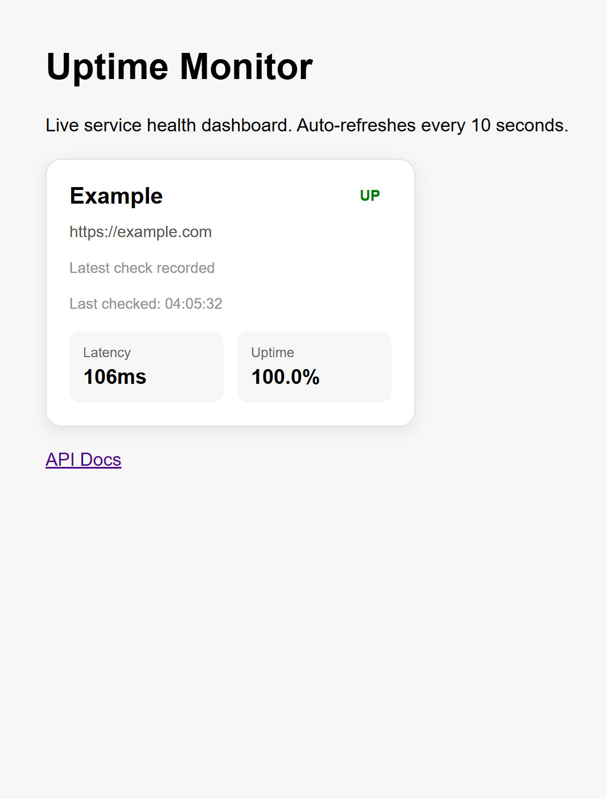

# Uptime Monitor

A backend system that monitors service availability, performs periodic health checks, and sends alerts on downtime.

---

## Features

- Periodic uptime checks (every 10 seconds)
- Retry logic for transient failures
- Parallel health checks (async with httpx)
- Persistent storage with PostgreSQL / SQLite
- Discord alert integration (down / recovery)
- Dashboard UI for real-time monitoring
- Rate limiting on manual checks
- Health check endpoint for service monitoring

---

## Architecture
Client → FastAPI → Scheduler → HTTP checks
↓
Database
↓
Dashboard / Alerts


---

## Tech Stack

- Python
- FastAPI
- SQLAlchemy
- PostgreSQL / SQLite
- Docker
- APScheduler
- httpx (async requests)
- Discord Webhook

---

## API Endpoints

### Core
- `GET /` → Dashboard
- `GET /health` → Service health
- `GET /queue` → Queue status

### Targets
- `POST /targets`
- `GET /targets`
- `PUT /targets/{target_id}`
- `DELETE /targets/{target_id}`

### Monitoring
- `POST /check`
- `GET /checks`
- `GET /stats`
- `GET /targets/{target_id}/stats`

---

## Run Locally

```bash
docker compose up --build
Environment Variables
```

Create a .env file from .env.example:

cp .env.example .env

Required variables:

- `DATABASE_URL`
- `DISCORD_WEBHOOK_URL`

---

## Screenshot




---

## What this project demonstrates

- Backend system design for monitoring services
- Handling unreliable networks with retry logic
- Async parallel processing for scalability
- Database persistence and query optimization
- Basic observability (logs + alerts)
- API design and rate limiting

---

## Future Improvements

- Queue system (Celery / Redis)
- Advanced alerting (Slack / Email)
- Frontend dashboard improvements (charts)
- Authentication & multi-user support
- Distributed monitoring (multi-region checks)